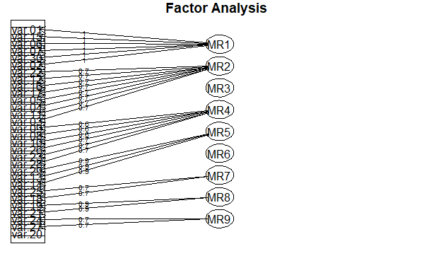
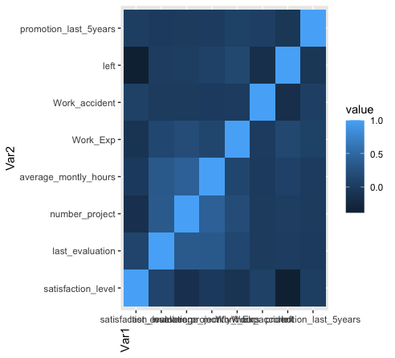
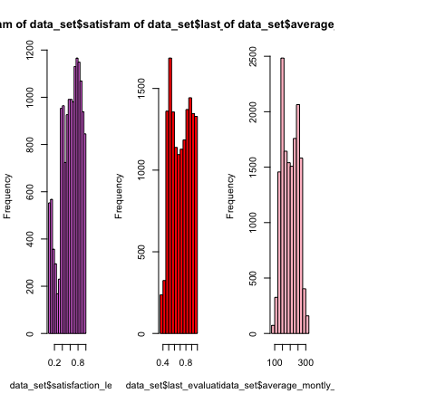
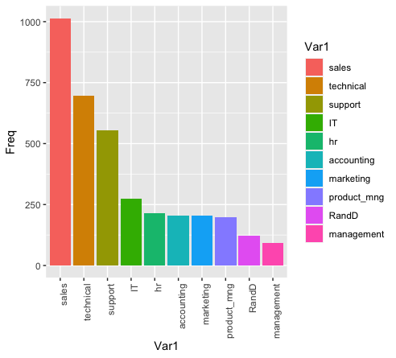
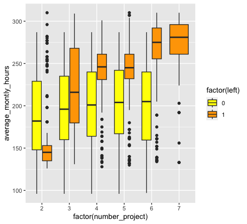

# HR Data Visualization Projects

## Objective
This repo is dedicated to sharing my experiment with miscellaneous Hr data visualization projects with others.

Most of my visualization work is coded with R, directories will include datasets and code files. Code files will include comments to walk through different steps of generating the visualization.

## Gallery

### [Employee-Experience](./Employee-Experience/EmpExp.R)

 

### [ML-Processing](./ML-Processing/ML-pipeline-of-Preprocessing.R)

 
  

  

